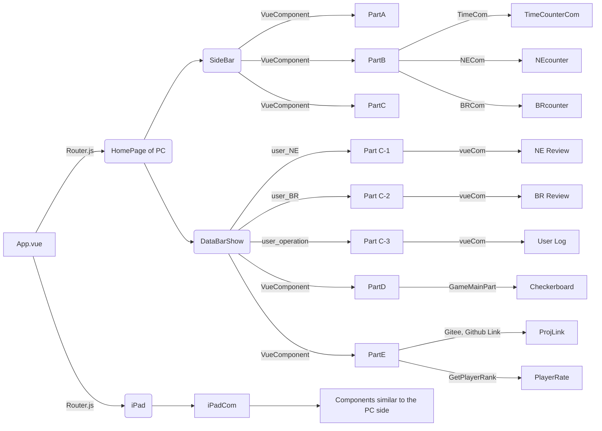
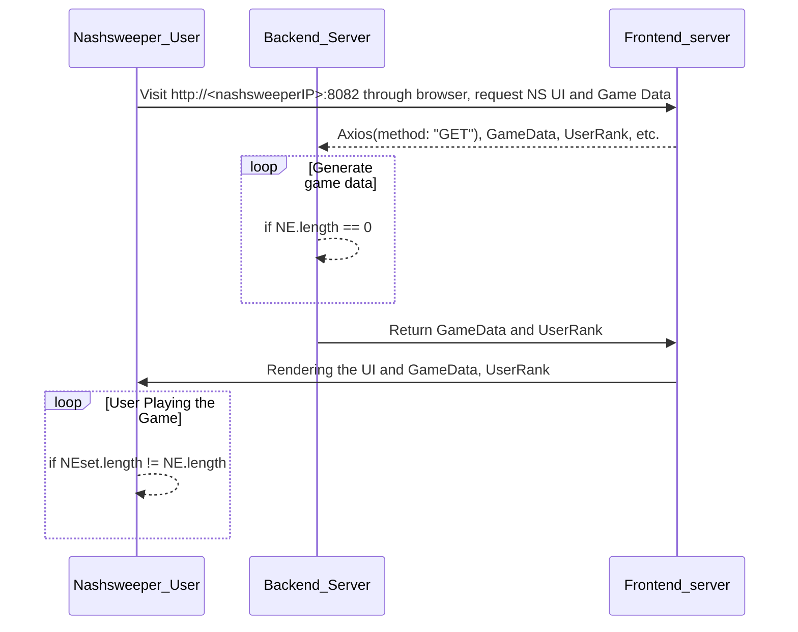

# Nashsweeper
## 0x00 Introduction
Nash equilibrium is a core concept of game theory. This repo shows a playful introduction of Nash equilibrium and designs a game named Nashsweeper, which is a game designed to find the pure strategy.<br>
<!--  -->
## 0x01 How to use?
### In dev mode
* If you want to run this project, you should start the backend service firstly by changing your terminal path to [nashsweeper-banckend](./nashsweeper-backend/) and reading the [readme file](nashsweeper-backend/README.md) carefully. Then you should run the frontend service by changing your disk to [nashsweeper-front](./nashsweeper-front/) and follow the [readme file](nashsweeper-front/README.md) step by step.
* What deserves your attention most is that both the backend and frontend services ports cannot be taken by other applications, or you won't be able to run it correctly.
### In Docker Micro-service mode
**This instruction only applies to Linux!!!**
* STEP 1: Make sure you have installed docker in advance. If you didn't, just run the following command:
```shell
# if you are in China, you can use tsinghua source for faster installing docker
export DOWNLOAD_URL="https://mirrors.tuna.tsinghua.edu.cn/docker-ce"
# if you use curl
curl -fsSL https://get.docker.com/ | sh
# or wget
wget -O- https://get.docker.com/ | sh
```
* STEP 2: Make sure you have **docker-compose**, **git** installed
```shell
sudo apt install docker-compose git
```
* STEP 3: Git this repository and change disk to the repository
```shell
git clone https://gitee.com/qian_zehao/nashsweeper.git
cd path/to/nashsweeper
```
* STEP 4: Edit the profile for frontend to backend
```shell
# edit the two belowing profile 
# nashsweeper/nashsweeper-front/BackendServerInfo.json
# nashsweeper/nashsweeper-front-ipad/BackendServerInfo.json
{
    "backendIP": "http://127.0.0.1:5000/",
    # change the backendIP from 127.0.0.1:5000 to your IP address
    # For example: In my home, my device IP is 192.168.1.104
    # and my backend port is 5000
    # so backendIP is: "backendIP": "http://192.168.1.104:5000/",
    "backendName":"Server Name",
    "backendOS":"Server OS",
    "backendCapacity":"Server Cap"
}
```
* STEP 5: Build the images of nashsweeper
```shell
sudo docker-compose build
```
* STEP 6: Run the containers
```shell
sudo docker-compose up -d
```
* STEP 7: Stop nashsweeper
```shell
sudo docker-compose down
```
## 0x02 Software Architecture
### Frontend User Interface Render


### Backend DataProcess

